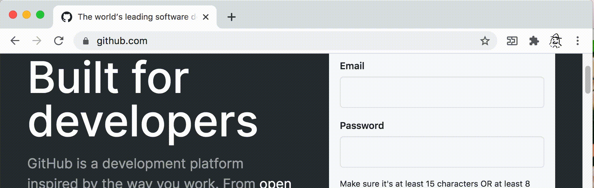
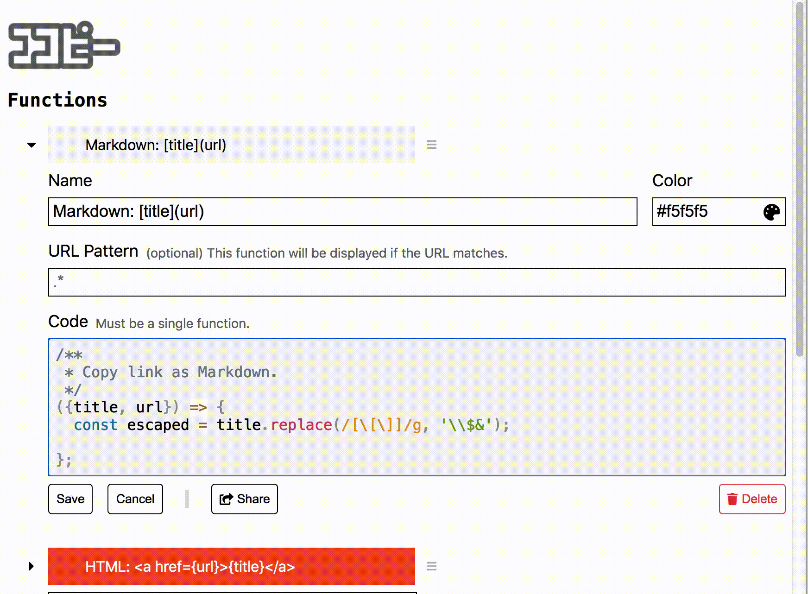

cocopy
===


a chrome extension to copy text by your code.

(In Japanese) コードで(by code) コピー(copy)

## Install

Install from [Chrome Web Store](https://chrome.google.com/webstore/detail/cocopy/ihnfodlbkhgjnbheemjhkjfkfglgbdgc)

## Usage

### Execute Function to Copy

- By selecting a function, it runs with the current page content.
- The return value of the function is copied to the clipboard.
- You can use the number keys to select a function.




### Create & Edit Function

- You can open the options page from the cog icon ⚙️ on the popup and define & edit a function
- The function receives an object having these properties.

| property | type| description |
| --- | --- | --- |
| `title` | `string` | The page title. Same as `document.title`. |
| `url` | `string` | The page url. Same as `location.href`. |
| `content` | `string` | HTML content of current page. <br>Same as `document.documentElement.outerHTML` <br>You can query this using [`DOMParser`](https://developer.mozilla.org/docs/Web/API/DOMParser). |
| `selectingText` | `string` | Text currently selected on the page. <br>Same as `window.getSelection().toString()`. |
| `modifier` | `object` | Flags of modifier key being pressed when a function executed. <br>The keys are `alt`, `ctrl`, `meta` and `shift` |

- The code runs safely under the [sandbox](https://developer.chrome.com/apps/sandboxingEval), not under the page.




### Keyboard Shortcut (optional)

Set it up in `chrome://extensions/shortcuts` .

The default suggested keys to open popup are <kbd>Ctrl+Shift+L</kbd> or <kbd>Cmd+Shift+L</kbd>(Mac).

Check for the settings conflicts with other extensions and re-input your shortcut keys if it doesn't work. (e.g. [1Password X](https://chrome.google.com/webstore/detail/1password-x-%E2%80%93-password-ma/aeblfdkhhhdcdjpifhhbdiojplfjncoa))


## Function Gallery

[Go to the gallery](./gallery/README.md) to add more functions and see sample codes.

There are functions to ...

- Simplify Amazon.co.jp URL.
- Copy current playing position on YouTube video.


## Import/Export

In options page & open console

```js
// export to clipboard
chrome.storage.sync.get('functions', copy)

// import
const obj = /* paste here */;
chrome.storage.sync.set(obj)
```
