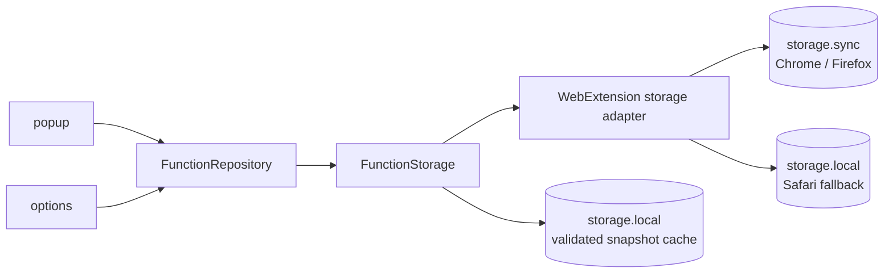
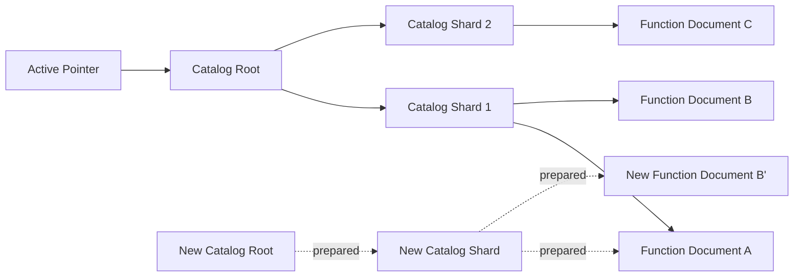

# FunctionStore

- Status: Draft, ready for implementation
- Created: 2026-07-20

## Objective

関数が増えたりコードが長くなったりしても安全に一覧表示・編集・保存でき、Chrome・Firefox・Safari で同じアプリケーション設計を使える関数ストレージを提供する。

## Background

cocopy は、ユーザーが定義したコピー関数を popup から実行し、options から追加・編集・削除・並べ替えする WebExtension である。
popup と options では、同じ関数データに対して異なる参照特性がある。

- popup は現在の URL で関数を絞り込み、一致した関数の表示情報とコードを必要とする。
- options の一覧は全関数の表示情報と順序を必要とするが、コードは editor を開いた関数についてのみ必要とする。
- options の保存は、1 関数の編集、追加、削除、並べ替えを独立して扱う。

関数は、同じブラウザアカウントを使用する複数端末で共有できることが望ましい。
そのため、同期を実装する Chrome と Firefox では `storage.sync` を関数の正本にする。
Safari は `storage.sync` API を提供するが端末間同期を行わないため、同じ論理形式を `storage.local` に保存する。

`storage.sync`による同期範囲は、同じGoogleアカウントを使うChrome間、または同じMozillaアカウントを使うFirefox間である。
ChromeとFirefoxの間では同期しない。

`storage.sync` は Chrome と Firefox で 1 item 8,192 bytes、全体 102,400 bytes、最大 512 items に制限される。
全関数を1 itemに格納せず、Pointer、Catalog、関数ごとのDocumentへ分けることで、1 itemの上限ではなくstorage全体の上限まで利用する。
全体上限を超えるデータは暗黙にlocalへ退避せず、説明可能な容量エラーとして保存を拒否する。

参照資料:

- [Chrome Extensions: chrome.storage](https://developer.chrome.com/docs/extensions/reference/api/storage)
- [MDN: storage API](https://developer.mozilla.org/en-US/docs/Mozilla/Add-ons/WebExtensions/API/storage)
- [MDN: storage.sync](https://developer.mozilla.org/en-US/docs/Mozilla/Add-ons/WebExtensions/API/storage/sync)
- [Apple: Assessing your Safari web extension's browser compatibility](https://developer.apple.com/documentation/safariservices/assessing-your-safari-web-extension-s-browser-compatibility)

## Goals

- 維持する: 関数が増えても popup が URL に一致する関数を効率よく取得できる状態を維持する。
- 同期する: ChromeとFirefoxでは、同じブラウザアカウントを使用する複数端末へ関数を同期する。
- 最小化する: options の一覧表示と 1 関数の編集に必要な読み書きを最小化する。
- 防止する: 保存中の終了や quota 超過によって、直前まで利用できていた関数集合が破損することを防止する。
- 明確にする: 保存成功、未保存、競合、容量不足、データ破損を UI で区別できるようにする。
- 分離する: アプリケーションの repository を WebExtensions API から分離し、ブラウザごとの差を storage adapter に閉じ込める。
- 復旧できるようにする: 到達不能データや破損を検出し、正常な snapshot から復旧できるようにする。

## Non-Goals

- 複数端末で同時編集したデータのマージは扱わない。
- ユーザー関数の sandbox 実行方式は変更しない。
- 大規模データベース向けの全文検索やページネーションは導入しない。
- ブラウザごとの最大容量までデータを保存することは保証しない。
- `storage.sync` の全体quotaを超える関数を端末ローカルだけに暗黙保存しない。
- SafariではWebExtensions標準APIだけで端末間同期を保証しない。
- ChromeとFirefoxの間を横断して関数を同期しない。

## Scenarios

### popup で関数を実行する

1. popup がアクティブタブの URL を取得する。
2. repository が現在の Catalog を読み、順序を保ったまま URL pattern に一致する entry を抽出する。
3. repository が一致した entry の Function Document だけを一括取得する。
4. repository が各 document を検証し、`CopyFunction[]` を返す。
5. popup は Catalog の順序で関数を表示し、ユーザーが選んだ関数を sandbox に渡す。

不正な URL pattern は保存時に拒否する。
読み取り時に不正な entry や document を発見した場合、その関数を実行対象から外し、他の正常な関数は利用可能な状態を保つ。

### options で関数を編集する

1. options が Catalog から関数名、テーマ、URL pattern、順序を読み、コードを読まずに一覧を表示する。
2. ユーザーが関数を開くと、repository が対応する Function Document を読む。
3. ユーザーが保存すると、repository が schema と portable size limit を検証する。
4. repository が新しい Function Document と Catalog を準備し、読み戻して検証する。
5. repository が Active Pointer を新しい Catalog へ切り替える。
6. options は永続化の完了後にだけ「保存済み」と表示する。

保存に失敗した場合、options は入力内容を保持し、再試行または JSON export を可能にする。

### 関数を追加・削除・並べ替える

- 追加は新しい Function Document を作り、その参照を含む Catalog へ切り替える。
- 削除は対象への参照を除いた Catalog へ切り替え、削除した document は garbage collection まで残す。
- 並べ替えは Function Document を変更せず、entry の順序が異なる Catalog へ切り替える。

## Architecture



図のソースはこの文書内の Mermaid ブロックとする。

依存方向は UI → application repository → storage port とする。
domain と application 層から `chrome.*` / `browser.*` を参照しない。

### Domain

- `CopyFunction`: 実行可能な完全な関数。
- `FunctionSummary`: `id`, `name`, `pattern`, `theme`, `version` からなる一覧・検索用 projection。
- Valibot schema: Function Document、Catalog、Active Pointer を永続化境界で検証する。

`FunctionSummary` は Catalog に複製するが、commit 対象の `CopyFunction` から repository が生成する。
UI が summary と document を別々に組み立ててはならない。

### Application Repository

repository は、UI に次の契約を提供する。
正確な TypeScript 名は実装時に調整してよい。

```ts
interface FunctionRepository {
  listSummaries(): Promise<FunctionSummary[]>;
  listForUrl(url: string): Promise<CopyFunction[]>;
  get(id: string): Promise<CopyFunction | undefined>;
  create(fn: CopyFunction): Promise<void>;
  update(fn: CopyFunction): Promise<void>;
  delete(id: string): Promise<void>;
  reorder(orderedIds: string[]): Promise<void>;
  subscribe(listener: () => void): Unsubscribe;
}
```

- mutation は永続化完了まで resolve しない。
- schema error、quota error、conflict、corruption を型付き error として返す。
- `listForUrl` が URL pattern の評価と必要 document の一括取得を担当する。
- `subscribe` は「active snapshot が変わった」ことを通知し、受信側は repository からデータを再読込する。

### Storage Port

```ts
interface KeyValueStorage {
  get(keys: string[]): Promise<Record<string, unknown>>;
  getAll(): Promise<Record<string, unknown>>;
  set(items: Record<string, unknown>): Promise<void>;
  remove(keys: string[]): Promise<void>;
  subscribe(listener: (changedKeys: string[]) => void): Unsubscribe;
}
```

Chrome adapter は `chrome.storage.sync`、Firefox adapter は `browser.storage.sync` を包む。
Safari adapter は同じkey/value契約を `browser.storage.local` で実装する。
callback / Promise、namespace、同期可否の差はadapter内に閉じ込める。

ChromeとFirefoxでは、最後に検証できたsnapshotを `storage.local` にcacheする。
sync itemは端末間で到着順が保証されないため、新しいPointerだけが先に届いて参照先がまだ欠けている場合、repositoryは不完全なsnapshotを公開せずcache済みの旧snapshotを返す。
必要itemが揃った後に再検証してcacheを更新する。
cacheは正本ではなく、同期先での一時的な不整合に耐えるためのmaterialized snapshotである。

`window.localStorage` は使用しない。
これは WebExtensions の `storage.local` とは別の同期 API で、extension Service Worker から利用できず、拡張向けの change event と lifecycle semantics を持たない。

## Storage Model

FunctionStore は、Active Pointer、論理的に1つのCatalog、関数ごとのFunction Documentで構成する。
Catalogは8 KiBを超えない複数のCatalog Shardへ物理的に分割できる。



図のソースはこの文書内の Mermaid ブロックとする。

正本はChromeとFirefoxでは `storage.sync`、Safariでは `storage.local` に保存する。
キーにはアプリケーション名とstorage format versionを含める。
以降のCatalog RootとShardを合わせて、論理的なCatalogと呼ぶ。

### Active Pointer

Key: `cocopy:function-store:active`

```json
{
  "formatVersion": 1,
  "catalogId": "01J..."
}
```

- すべての読み取りは Active Pointer から開始する。
- Pointer が指す Catalog だけが commit 済みの正本である。
- Pointer の切り替えを、複数 item にまたがる mutation のコミット点とする。

### Catalog Root

Key: `cocopy:function-store:v1:catalog:<catalogId>`

```json
{
  "formatVersion": 1,
  "catalogId": "01J...",
  "createdAt": "2026-07-20T00:00:00.000Z",
  "shardIds": ["01J...", "01K..."]
}
```

- Catalog Rootは順序付けされたShard IDだけを持つ。
- Rootと各Shardは、key長を含めて1 itemのquota未満でなければならない。
- Catalogは不変とし、並べ替えを含むmutationごとに新しい`catalogId`を作る。

### Catalog Shard

Key: `cocopy:function-store:v1:catalog-shard:<shardId>`

```json
{
  "formatVersion": 1,
  "catalogId": "01J...",
  "shardId": "01J...",
  "entries": [
    {
      "id": "builtin-markdown",
      "documentId": "01J...",
      "version": 1,
      "name": "Markdown: [title](url)",
      "pattern": null,
      "theme": {
        "textColor": "#000000",
        "backgroundColor": "#f5f5f5"
      }
    }
  ]
}
```

- Rootの`shardIds`順と各Shardの`entries`順を連結した順序を、optionsとpopupの表示順とする。
- entry は URL filter と一覧表示に必要な情報だけを持つ。
- `id` は関数の論理 ID、`documentId` は保存上の不変 document ID として分ける。
- user-controlled な `id` を storage key に直接埋め込まない。
- Shardはentry境界で分割し、key長を含むserialized sizeが1 itemのquota未満になるようにする。

### Function Document

Key: `cocopy:function-store:v1:function:<documentId>`

```json
{
  "formatVersion": 1,
  "documentId": "01J...",
  "function": {
    "id": "builtin-markdown",
    "name": "Markdown: [title](url)",
    "code": "...",
    "version": 1,
    "theme": {
      "textColor": "#000000",
      "backgroundColor": "#f5f5f5"
    }
  }
}
```

- 1 関数の完全な実体を 1 item に保存する。
- key長とvalueを含むserialized sizeが1 itemのquotaを超える関数は、保存を拒否する。
- document は不変とし、編集時は同じキーを上書きせず新しい `documentId` を作る。
- Catalog entry は document から導出する。
- 読み取り時に ID や summary が一致しなければ corruption として扱い、そのコードを実行しない。

## Commit Protocol

WebExtensions storage は、複数 item にまたがる transaction や compare-and-swap を共通 API として提供しない。
FunctionStore は copy-on-write と Active Pointer により、旧 snapshot または新 snapshot のどちらか一方だけを公開する。

1. mutation 開始時の `catalogId` を記録する。
2. 新規または変更された Function Document を新しいキーへ書く。
3. mutation後の全entryを持つ新しいCatalog ShardとCatalog Rootを書く。
4. 新しいdocument、Shard、Rootを読み戻し、schema、参照、summary、容量を検証する。
5. Active Pointer を再読込し、手順1の `catalogId` と異なる場合は `ConflictError` としてcommitを中止する。
6. Active Pointer を新しい `catalogId` へ切り替える。
7. Pointer を読み戻して commit 結果を確認する。

手順2〜5で失敗した場合、Pointerは旧Catalogを指したままなので、従来のsnapshotを読み続けられる。
途中まで作られたitemはorphanとして後で回収する。

別端末ではPointer、Root、Shard、Documentが異なる順序で同期されうる。
新Pointerの参照先が揃うまではlocal cacheの旧snapshotを利用し、欠損をcorruptionとして確定しない。
一定期間再取得しても揃わない場合に同期エラーとしてoptionsへ表示する。

Active Pointer の更新自体は last-write-wins であり、storage API だけでは完全な排他を保証できない。
極端に近い複数 context の同時 commit では、一方の更新が後勝ちになる可能性を許容する。
repository は revision 確認により競合範囲を狭め、競合を検出した場合は自動マージせず UI に再読込を要求する。

## Capacity and Performance

ChromeとFirefoxの`storage.sync` quotaを共通profileとする。

- 1物理itemは、key長とJSON valueを合わせて8,192 bytes未満とする。
- 全sync itemは、key長とJSON valueを合わせて102,400 bytes未満とする。
- item数は512未満とする。
- 書き込み回数は1分120回、1時間1,800回のquota内に収め、1 mutationのitemを可能な範囲で1回の`set`にまとめる。
- 容量の事前判定にはstorage area全体を対象とする`getBytesInUse(null)`を使い、FunctionStore以外のsync itemとlegacy itemも計算に含める。
- commit前に、旧snapshot、新document、新Catalog、Pointerが同時に存在するpeak usageを見積もる。
- quota内でもcopy-on-writeの一時領域を確保できなければmutationを開始しない。
- optionsに現在の使用量、次の保存に必要なpeak usage、quotaに対する割合を表示する。
- quota超過時は保存を拒否し、JSON exportまたは不要な関数の削除を案内する。
- 端末間で保存内容が異なる状態を成功として扱わないため、`storage.local`への暗黙fallbackは行わない。
- アプリケーションの事前検証に成功しても、browser側の書き込み失敗は必ず捕捉する。

Pointer、shard化したCatalog、Function Documentへ分割するため、overheadとcommit用headroomを除いて`storage.sync`全体の約100 KiBまで利用できる。
利用可能量はデータの形状とmutation内容に依存するため、固定の関数件数では保証しない。

- popupはCatalog Rootと全Shardを読み、URLに一致するFunction Documentだけを読む。
- 複数 document は1回の `get` にまとめ、N+1 readを避ける。
- options初期表示ではCatalogだけを読み、codeはeditorを開くまで読まない。
- reorderはCatalogだけを新しく作り、Function Documentを複製しない。

## Garbage Collection

次の item を削除対象とする。

- Active Pointer の Catalog から到達不能な Function Document。
- Active Pointer が指していない Catalog RootとCatalog Shard。
- 失敗した commit が残した orphan。

GCは正しさに必須ではなく、best effortとする。
削除直前にActive Pointerを再読込し、到達可能なitemを改めて除外する。
削除対象は`cocopy:function-store:v1:` prefixに限定し、storage areaの`clear()`は使用しない。

commit の容量確保が必要な場合は既存 orphan の GC を先に試み、それでも不足すれば mutation を失敗させる。

## Data Integrity and Error Handling

- storage から得た `unknown` はすべて Valibot schema で検証し、型 assertion だけで通さない。
- Catalog 内の論理 ID と document ID は一意でなければならない。
- Catalog summary は参照先 document から再計算した値と一致しなければならない。
- URL pattern は保存時に `RegExp` として構築可能か検証する。
- 欠損 document、schema 不一致、summary 不一致は `CorruptionError` とする。
- popup は破損した関数を実行せず、正常な関数を表示する。
- options は正常な関数と診断情報を表示し、JSON export を可能にする。
- mutation 中は同じ UI からの Save、Delete、Reorder の競合操作を無効化する。
- mutation 成功後は手元の state を正本とせず、repository から active snapshot を再読込する。
- mutation 失敗時は editor の入力を保持する。

## Security and Privacy

### 不正な storage データから意図しないコードが実行される

Scenario: storage は DevTools、拡張機能の不具合、旧バージョンなどから想定外の値を受け取りうる。
壊れた Catalog が別 document を指すと、ユーザーが意図しないコードを実行する可能性がある。

Mitigations:

- Pointer、Catalog、Function Document の全境界を schema 検証する。
- Catalog と document の ID および summary の一致を検証する。
- ユーザーコードは sandbox だけで実行し、popup と options では評価しない。

### GC が他の設定を削除する

Scenario: 全 storage の列挙後に広すぎる条件で削除すると、FunctionStore が所有しない設定を失う。

Mitigations:

- GC の対象を FunctionStore の versioned prefix に限定する。
- `clear()` を使用しない。
- storage adapter ではなく repository が所有権を判断する。

関数コード、URL pattern、名前はユーザーの個人情報や業務情報を含みうる。
ChromeとFirefoxではブラウザベンダーの同期基盤を経由するが、cocopy独自のserverへは送信しない。
Safariでは端末ローカルに保持する。
JSON exportはユーザーの明示操作でのみ行う。

## Testing Strategy

### Repository Unit Tests

複数 item の get/set/remove、change event、失敗注入を行える in-memory `KeyValueStorage` fake を用意する。
domain repository test は特定の browser mock library に結合しない。

- URL pattern で Catalog を絞り、一致した document だけを読む。
- create/update/delete/reorder 後の順序と内容を保持する。
- document、Catalog、Pointer の各書き込み地点で失敗しても旧 snapshot を読める。
- quota error を呼び出し元へ返す。
- Catalogを複数Shardへ分割しても、順序とsummaryを維持する。
- orphan GC が active snapshot と他機能のキーを削除しない。
- schema 不正、欠損 document、重複 ID、summary mismatch を検出する。
- 2 writer の revision conflict を検出する。
- Pointerだけが先に同期された場合、完全な新snapshotが揃うまでlocal cacheを返す。

### Adapter Integration Tests

WebExtension storage adapter は、対象ブラウザに近い fake または実ブラウザで次を検証する。

- 値の set/get/remove が Promise 契約へ正規化される。
- browser の書き込みエラーが reject される。
- Active Pointer の変更だけを subscription が通知する。
- 複数キーを一括取得できる。
- ChromeとFirefoxではsync area、Safariではlocal areaが選択される。

### UI and E2E Tests

- 合計8 KiBを超える複数関数を保存し、reload後に実行できる。
- 1 itemのquotaを超える単一関数と、全体quotaを超える関数集合を保存できない。
- Catalogが複数Shardになるfixtureで、URLに一致する関数だけをpopupへ返す。
- 保存失敗時に成功表示にならず、編集中の内容が残る。
- options の一覧表示では Function Document を取得せず、editor を開いた時だけ取得する。

## Alternatives Considered

### 関数を複数 chunk に分割して `storage.sync` に保存する

- Pros: 1 item 8 KiBを超える関数も保存できる。
- Cons: 全体100 KiBとitem数の制限は残り、再構築、部分欠損、同期競合が複雑になる。

1関数を1つの独立documentとして扱う単純さを優先し、item上限を超える関数は保存しない。

### `storage.local`を正本にする

- Pros: Chromeでは既定10 MiBまで利用でき、1 item 8 KiBと全体100 KiBのsync quotaを避けられる。
- Cons: ChromeとFirefoxの複数端末へ関数を同期できない。

端末間同期を優先するため採用しない。
quota超過時だけ暗黙にlocalへfallbackする案も、端末ごとに異なる関数集合を成功状態として作るため採用しない。

### IndexedDB

- Pros: transaction、index、大容量データに向く。
- Cons: 目標規模には重く、extension context とブラウザ差の検証範囲が広がる。

同期容量を拡張する要件が生じた場合は、IndexedDB単体ではなく独自sync backendと組み合わせたrepositoryを別途検討する。

### `window.localStorage`

- Pros: API が単純である。
- Cons: 同期 API で、extension Service Worker から利用できず、WebExtensions storage の change event と lifecycle semantics を持たない。

採用しない。

### Mutable Document と単一 Catalog

- Pros: item 数と一時使用量が少ない。
- Cons: document と Catalog の間で書き込みが止まると、rollback 不能な中間状態を公開しうる。

保存失敗時にも旧 snapshot を維持するため、copy-on-write と Active Pointer を採用する。

---

## AsIs（移行完了後に削除）

現在の `src/lib/config.ts` は、すべての `CopyFunction` を配列にし、`chrome.storage.sync` の単一キー `functions` に保存する。

```text
storage.sync
└── functions: CopyFunction[]
```

この構造には次の制約がある。

- 全関数が1 itemなので、合計が8 KiBを超えると保存できない。
- 1関数の編集や並べ替えでも全配列を読み書きする。
- popup は一致しない関数のcodeも読み、その後メモリ上で絞り込む。
- `FunctionsReducer` は保存 Promise を待たず、永続化失敗時にも画面上のstateを更新する。
- `config.ts`、React component、`chrome.storage` が直接結合している。
- `useSubscribeFunctions` は `storage.onChanged` の `functions` キーを直接監視する。

既存データ形式を、以降「legacy storage」と呼ぶ。

## Migration Plan（移行完了後に削除）

### Compatibility Policy

- legacy storage の `storage.sync["functions"]` は移行処理から変更・削除しない。
- FunctionStore の Active Pointer が存在する場合は、legacy storage を自動で再移行しない。
- FunctionStore の初期化が完了するまでは、検証済みの legacy data を読み取り専用で利用できる。
- 旧バージョンへrollbackした場合も、旧バージョンが読むlegacy dataを残す。
- legacy itemもsync quotaを消費するため、保持中はその使用量をFunctionStoreの容量計算に含める。

### Migration Coordinator

通常の `FunctionRepository` に legacy 分岐を含めず、移行を `MigrationCoordinator`、legacy data の参照と復旧を read-only な `LegacyBackupRepository` に分ける。

初回移行は次の順序で行う。

1. `storage.sync["cocopy:function-store:active"]` を読む。
2. Active Pointer がなければ、`storage.sync["functions"]` をデフォルト値なしで読む。
3. legacy key 自体がなければ、組み込みの `defaultFunctions` を初期データとする。
4. 配列、各関数、ID の一意性、URL pattern を検証する。
5. legacy dataの生JSONを`storage.local["cocopy:legacy-backup:sync-functions"]`へ保存し、読み戻して一致を確認する。
6. legacy item、新しいFunctionStore、copy-on-writeの一時itemを含むpeak usageがsync quota内か確認する。
7. 各Function Document、Catalog Shard、Catalog Rootを`storage.sync`に書く。
8. 書いたデータを読み戻し、件数、順序、内容が移行元と一致することを確認する。
9. 最後にActive Pointerを`storage.sync`へ書いてFunctionStoreを有効化する。
10. 移行結果を`storage.local["cocopy:migration:sync-functions-to-function-store-v1"]`に記録する。

Active Pointer を最後に書くため、途中で失敗しても不完全な FunctionStore は公開されない。
次回起動時は同じlegacy dataから新しいsnapshotを作り直す。
前回のitemはorphanとしてGCする。

空配列は「legacy keyなし」と区別し、ユーザーが全関数を削除した有効な状態として移行する。
不正なlegacy dataは自動で一部を捨てず、Active Pointerを作らない。

### Legacy Storage Backup UI

options に一時的な「Legacy storage backup」セクションを追加する。

- sync上のlegacy keyとlocal backupの有無、JSON byte数、件数、検証結果を表示する。
- 未知fieldや不正な要素を含む原本全体をread-only JSONとして表示する。
- 原本をJSONファイルとしてexportできるようにする。
- 復旧前に検証結果とFunctionStoreへの反映内容をpreviewする。
- 全体復旧は現在のFunctionStoreを置換する新snapshotとしてcommitする。
- 復旧直前のCatalog IDをmigration metadataにcheckpointとして残す。
- 一部が不正な場合は、validな関数だけを新しい論理IDで追加する操作と、exportして手動修正する選択肢を提供する。
- 復旧後もlocal backupを変更・削除しない。

このUIでは、legacy dataが現在のバックアップではなく「移行時点の読み取り専用原本」であることと、FunctionStoreの有効化日時を明示する。

### Implementation Sequence

1. schema、repository interface、in-memory fake、FunctionStore repositoryをUIから独立して実装する。
2. Migration CoordinatorとLegacy Backup Repositoryを実装し、障害注入テストを通す。
3. optionsにmigration statusとLegacy Storage Backup UIを追加する。
4. optionsの一覧、editor、mutationをFunctionRepositoryへ切り替える。
5. popupを`listForUrl`へ切り替える。
6. migration、Catalog sharding、quota超過、同期到着順、失敗時挙動をE2Eとintegration testへ追加する。
7. 1リリース以上legacy dataを保持し、実利用でmigration failureがないことを確認する。

### Migration Tests

- legacy keyなしではdefault functionsをseedする。
- legacyの空配列を空のFunctionStoreとして移行する。
- 正常なlegacy dataの内容と順序を変えずに移行する。
- 不正なlegacy dataではActive Pointerを作らない。
- legacy raw backupの検証が終わるまでFunctionStoreを書き始めない。
- legacy itemを含むpeak usageがquotaを超える場合、安全に移行を中止する。
- 各書き込み地点で失敗してもlegacy dataが変化せず、次回再試行できる。
- FunctionStoreが有効化済みならlegacy dataを再移行しない。
- Legacy Storage Backup UIからraw JSONを確認、export、preview、復旧できる。

### Removal Criteria

次をすべて満たした後、この文書の `AsIs` と `Migration Plan` を削除できる。

- popupとoptionsがFunctionRepositoryだけを使用している。
- legacy形式へ書き込むコードが存在しない。
- migration failureとrecovery pathがリリース済み環境で検証されている。
- legacy supportを終了するリリース方針が決定している。
- Legacy Storage Backup UI、Migration Coordinator、Legacy Backup Repositoryを削除してよい状態になっている。

削除後も、上部のObjectiveからAlternatives ConsideredまではFunctionStoreの恒久的な設計文書として単独で成立する。
