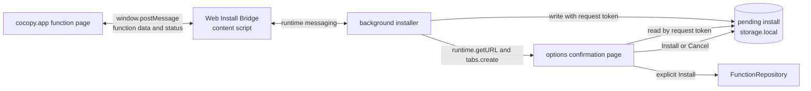
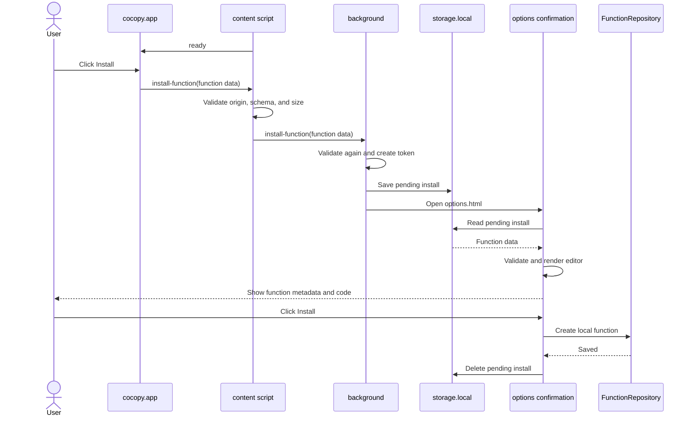
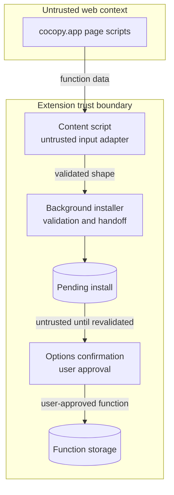

# Cocopy Web Install Bridge

- Status: Draft
- Created: 2026-07-20

## Objective

通常の HTTPS ページに表示した Install ボタンから、Chrome、Firefox、Safari の cocopy へ関数を追加できる共通の導線を提供する。

## Background

この文書で使用する `cocopy.app` と `www.cocopy.app` は、Web Install Bridge の対象を説明するための仮ドメインである。
正式なドメインと origin は未決定であり、実装時には確定した値へ置き換える。

現在の共有リンクは、関数データを URL に埋め込み、固定した Chrome Extension ID の `chrome-extension://` URL へリダイレクトする。
この方式は Chrome 固有の URL scheme と Extension ID に依存するため、Firefox と Safari へ展開できない。

通常の Web ページから拡張へ直接メッセージを送る `externally_connectable` は Chrome と Safari で利用できるが、Firefox では利用できない。
ブラウザごとに通信方式を分けると、Web ページ、manifest、受信処理、E2E テストに二つの経路が生じる。

この設計では、`https://cocopy.app/*` だけで動作する **Web Install Bridge** content script を全ブラウザへ同梱する。
cocopy.app のページはブラウザ固有の拡張 API や Extension ID を参照せず、Install ボタンが押されたときに関数データ全体を `window.postMessage` で Web Install Bridge へ渡す。

Web ページから受け取ったデータは信頼しない。
拡張はデータ形式とサイズを検証し、拡張内の確認画面でユーザーが許可した場合にだけ関数ストレージへ保存する。

## Goals

- 共有できるようにする: ブラウザ固有 URL を含まない通常の HTTPS ページから関数を追加できるようにする。
- 統一する: Chrome、Firefox、Safari で同じ content script と内部メッセージプロトコルを利用する。
- 制限する: Web Install Bridge が動作する Web origin を `https://cocopy.app` に限定する。
- 自己完結させる: 関数 registry や関数 ID の解決 API を必要とせず、ページが保持する関数データだけで確認画面を開けるようにする。
- 確認できるようにする: 保存前に関数名、対象 URL、コードを拡張内で確認して編集できるようにする。
- 分離する: Web ページ、Web Install Bridge、インストール処理、確認画面、関数ストレージの責務を分離する。

## Non-Goals

- Web ページから拡張を無操作でインストールしない。
- ブラウザのストアを経由して、インストール前の関数データを拡張へ引き継がない。
- Web ページから受け取った関数を自動保存または自動実行しない。
- `chrome-extension://`、`moz-extension://`、Safari の拡張 URL を Web ページへ公開しない。
- 共有する関数を cocopy.app のサーバーへ登録または保存しない。
- 既存の共有 URL、Cloud Functions redirect、共有データ形式との後方互換性は保証しない。
- ユーザーコードを隔離して実行する sandbox の方式は、この設計では変更しない。
- cocopy.app 以外の第三者サイトから直接関数を追加できる汎用プロトコルは提供しない。

## Scenarios

### インストール済みの cocopy へ関数を追加する

1. ユーザーが cocopy.app の関数ページを開く。
2. Web Install Bridge が、拡張を利用できることを示す `ready` メッセージをページへ送る。
3. ページが「Install to cocopy」ボタンを有効にする。
4. ユーザーがボタンを押す。
5. ページが、関数データ全体を含む `install-function` メッセージを `window.postMessage` で送る。
6. Web Install Bridge が送信元、プロトコル、データ形式、サイズを検証し、background へ内部メッセージを送る。
7. background がデータを再検証し、ランダムな request token を生成する。
8. background が関数データを pending install として `storage.local` へ一時保存する。
9. background が `runtime.getURL()` で options の確認画面 URL を生成し、request token だけを付けて新しいタブで開く。
10. options が request token に対応する pending install を読み、schema を再検証して編集画面を表示する。
11. ユーザーが関数名、対象 URL、コードを確認し、必要なら編集する。
12. ユーザーが Install を押すと、options が新しいローカル ID を割り当てて関数ストレージへ保存する。
13. 保存に成功した後、options が pending install を削除する。

ユーザーが Cancel を押した場合も pending install を削除する。
確認画面を閉じただけの場合は、有効期限を過ぎた pending install を後続の cleanup が削除する。

### cocopy がインストールされていない

1. ユーザーが cocopy.app の関数ページを開く。
2. ページは一定時間内に Web Install Bridge の `ready` メッセージを受信しない。
3. ページは Chrome Web Store、Firefox Browser Add-ons、App Store へのリンクを表示する。
4. ユーザーは対象ブラウザのストアを別タブで開き、cocopy をインストールする。
5. ユーザーは元の関数ページへ戻る。
6. Web Install Bridge がまだ読み込まれていなければ、ページは再読み込みを案内する。
7. 再読み込み後は、インストール済みのシナリオへ進む。

ストアから元の関数ページへ戻る仕組みには依存しない。
関数ページ自身が表示中の関数データを保持する。

### 関数データを検証できない

1. Web Install Bridge または background が、未対応 schema、不正なフィールド、サイズ超過を検出する。
2. background は pending install を作らず、確認画面も開かない。
3. Web Install Bridge はリクエスト ID と分類済みのエラー種別だけをページへ返す。
4. ページは関数を追加できない理由を表示する。

エラーレスポンスに関数コードや拡張内部の例外内容を含めない。

## Architecture



図のソースはこの文書内の Mermaid ブロックとする。

Web ページと Web Install Bridge の間を、信頼できない入力を受け取る境界とする。
Web Install Bridge は転送と入力の事前検査だけを担当し、関数の永続化やコード実行を担当しない。

background installer は入力の再検証、pending install の管理、確認画面の起動を担当する。
options はユーザーの同意と編集を担当し、FunctionRepository はインストール済み関数の永続化を担当する。

### Data flow



図のソースはこの文書内の Mermaid ブロックとする。

## Interfaces

### Manifest permissions

すべてのブラウザビルドに、cocopy.app 専用の content script を含める。

```json
{
  "content_scripts": [
    {
      "matches": ["https://cocopy.app/*"],
      "js": ["web-install-bridge.js"],
      "run_at": "document_idle"
    }
  ]
}
```

`www.cocopy.app` や任意のサブドメインは暗黙に許可しない。
追加の origin が必要になった場合は、用途と管理主体を確認して個別に列挙する。

この構成では `externally_connectable` と `web_accessible_resources` を使用しない。

### Installable function

Web ページから渡す **InstallableFunction** は、ローカルストレージの ID を持たない関数定義である。
保存時に拡張が新しいローカル ID を生成する。

```ts
interface InstallableFunction {
  schemaVersion: 1;
  name: string;
  code: string;
  pattern?: string;
  theme: {
    textColor: string;
    backgroundColor: string;
  };
}
```

`schemaVersion` は Web Install Bridge プロトコル上の関数データ形式を表す。
保存形式のバージョンと一致させる必要はなく、options が現在のローカル形式へ変換する。

### Web page protocol

Web ページと Web Install Bridge は、ページの同じ `window` に対する `window.postMessage` で通信する。
メッセージには固定の送信元識別子とプロトコルバージョンを含める。

```ts
interface InstallFunctionRequest {
  source: 'cocopy-web';
  protocolVersion: 1;
  type: 'install-function';
  requestId: string;
  function: InstallableFunction;
}
```

ページは `targetOrigin` に `https://cocopy.app` を指定する。
Web Install Bridge は次の条件をすべて満たすメッセージだけを受理する。

- `event.source === window` である。
- `event.origin === 'https://cocopy.app'` である。
- Valibot schema に一致する。
- `requestId` と各文字列が定めた長さに収まる。
- JSON として計測したメッセージ全体がサイズ上限に収まる。

Web Install Bridge からページへ返すメッセージは、`ready`、`accepted`、`error` の三種類とする。
ページ上のスクリプトは応答を偽装できるため、応答は表示制御にだけ利用する。

### Internal extension protocol

Web Install Bridge は、検証済みの InstallableFunction を拡張内部の `runtime.sendMessage` で background へ送る。
background は content script の検証結果を信頼せず、メッセージを再検証する。

background は `sender.id` が自拡張を示し、`sender.tab.url` の origin が `https://cocopy.app` であることを確認する。
検証に失敗したメッセージには応答せず、pending install も作らない。

### Pending install

background と options の受け渡しには、`storage.local` の専用 namespace を使う。
`storage.sync` は pending install に使用しない。

```ts
interface PendingInstall {
  protocolVersion: 1;
  requestToken: string;
  createdAt: number;
  expiresAt: number;
  sourceOrigin: 'https://cocopy.app';
  function: InstallableFunction;
}
```

request token は暗号学的乱数から生成し、URL から推測できない値にする。
options の URL には関数データを含めず、request token だけを含める。

```text
options.html#/install?request=<request-token>
```

pending install はインストール済み関数の正本ではない。
Install または Cancel で削除し、有効期限を過ぎたレコードは background の起動時と新しい追加要求の処理前に削除する。
Web Install Bridge から pending install を読み書きする API は公開せず、利用可能なブラウザでは storage access level も拡張所有 context に制限する。

有効期限の初期値は 1 時間とする。
ブラウザ終了後に pending install から作業を再開できることは保証しない。

### Options confirmation page

確認画面は拡張 origin で動作し、次の情報を表示する。

- 関数名
- URL pattern
- コード全文
- テーマ
- 送信元 origin

確認画面では、保存前にすべての編集可能フィールドを変更できる。
Install を押した時点で現在の関数 schema とストレージ制約を再検証する。

確認画面を開くだけでは、関数を保存または実行しない。

## Data ownership and trust boundaries



図のソースはこの文書内の Mermaid ブロックとする。

content script は拡張の一部だが、ページから入力を受け取るため信頼境界の入口として扱う。
pending install から読んだデータも、保存済みデータや別バージョンの拡張が変更した可能性を考慮して再検証する。

## Security

### cocopy.app 上のスクリプトが追加要求を偽造する

Scenario: cocopy.app に読み込まれた悪意あるスクリプトが、ユーザー操作なしで `install-function` メッセージを送る。
拡張がメッセージ受信だけで保存すると、意図しないユーザーコードが追加される。

Mitigations:

- background から関数ストレージを直接変更しない。
- 拡張 origin の確認画面でコード全文を表示する。
- ユーザーが Install を押した場合にだけ保存する。
- 確認前の関数コードを実行しない。
- 同じタブからの追加要求を rate limit し、確認画面の連続起動を抑止する。

ページの Install ボタンは期待する操作導線であり、信頼できる user gesture の証明には使わない。
ページ上のスクリプトは `window.postMessage` を任意に呼び出せるため、拡張内の確認操作をセキュリティ境界とする。

### cocopy.app 以外のページが Web Install Bridge を呼び出す

Scenario: 別の Web origin が同じ形式のメッセージを作り、関数追加処理を起動しようとする。

Mitigations:

- content script の `matches` を `https://cocopy.app/*` に限定する。
- Web Install Bridge で `event.source` と `event.origin` を検査する。
- background で `sender.id` と `sender.tab.url` を再検査する。
- redirect 後の URL ではなく、メッセージ受信時の tab URL を検査する。

### ページが不正または巨大な関数データを送る

Scenario: ページが未知フィールド、不正な色、巨大なコード、または未対応 schema を含むメッセージを送る。

Mitigations:

- content script、background、options の各境界でデータを `unknown` として受け取る。
- 各境界で Valibot schema を使って検証する。
- メッセージ全体とコードにサイズ上限を設ける。
- pending install の namespace と件数を制限する。
- 検証に失敗したデータを options や FunctionRepository へ渡さない。

### request token を第三者が取得する

Scenario: request token が推測または漏えいし、別の拡張ページから pending install を読み取られる。

Mitigations:

- request token を暗号学的乱数から生成する。
- pending install は拡張の `storage.local` に保存し、Web ページから直接読めないようにする。
- 有効期限、Install、Cancel によって pending install を削除する。
- request token と pending install の対応がない場合は内容を表示しない。

### 関数コードが URL やログへ記録される

Scenario: コード全文を query parameter やログへ含めると、アクセスログ、ブラウザ履歴、解析サービスへ保存される。

Mitigations:

- options URL には request token だけを含める。
- Web ページから content script への転送にはサーバーへ送信されない `window.postMessage` を使う。
- background と content script のログに関数コードを出力しない。
- エラーレスポンスに関数データや例外の詳細を含めない。

## Privacy and logging

関数データは、表示中の cocopy.app ページから拡張の `storage.local` へ直接移動する。
Web Install Bridge の処理のために、cocopy.app のサーバーへ関数データを追加送信しない。

拡張に保存済みの関数一覧、編集内容、実行履歴は cocopy.app へ送信しない。
通常ログへ記録してよい情報は、時刻、リクエスト ID、成功または分類済みエラーに限定する。
関数コード、関数名、URL pattern、ローカル関数 ID、閲覧中タブの URL は記録しない。

## Browser behavior

Chrome、Firefox、Safari は、同じ Web Install Bridge と内部プロトコルを利用する。
ブラウザ API namespace と background manifest の形式差は、拡張の browser adapter と manifest generator が吸収する。

Safari では、ユーザーが cocopy.app への Web サイトアクセスを許可していない場合、Web Install Bridge が実行されない可能性がある。
Firefox と Chrome でも、インストール前から開いていたタブには content script が読み込まれない場合がある。
Web ページは `ready` を受信できないとき、未インストールと権限未許可を断定せず、インストール状況、サイトアクセス権限、再読み込みを確認する案内を表示する。

## Alternatives Considered

### `externally_connectable` と content script をブラウザで使い分ける

- Pros: Chrome と Safari では cocopy.app の content script permission を避けられる。
- Cons: Firefox だけ別経路になり、Web ページと拡張の通信実装、manifest、テストが二系統になる。

権限範囲を cocopy.app のみに限定できるため、実装経路の統一を優先して採用しない。

### Web ページから拡張 URL へ直接遷移する

- Pros: background と content script が不要になる。
- Cons: Chrome の固定 Extension ID、Firefox のランダムな extension UUID、Safari 固有の識別子と URL scheme に依存する。

Web ページがブラウザ固有の拡張 URL を知る必要があるため採用しない。

### 関数 ID だけを送って registry から取得する

- Pros: ページ間メッセージが小さくなり、公開関数のリリース管理を一元化できる。
- Cons: 関数を事前登録する registry と解決 API が必要になり、任意の関数をページだけで追加できない。

現時点では Web ページが保持する関数データをそのまま追加できることを優先して採用しない。
将来、公式 gallery に不変リリースが必要になった場合は、InstallableFunction を取得する手段として registry を追加できる。

### 関数データを options URL に埋め込む

- Pros: pending install の一時ストレージと cleanup が不要になる。
- Cons: 関数コードが拡張 URL、ブラウザ履歴、クラッシュレポートへ残り、URL 長の制約も受ける。

options URL には request token だけを含める方針として採用しない。

### content script から options を直接開く

- Pros: background の中継を省ける。
- Cons: options が開く前のデータ保持、タブ生成、失敗応答の責務が content script に混在する。

content script を信頼できない入力の adapter に限定するため採用しない。

## Open Issues

### InstallableFunction のサイズ上限

問題: ページ間メッセージ、pending install、保存形式に適用する portable なサイズ上限が未決定である。

検討した選択肢:

- 現在の `storage.sync` における 1 item の制限以下にする。
- FunctionStore の Function Document 上限と同じ値にする。
- Web Install Bridge に独立した上限を設ける。

直近の次の一手: FunctionStore の portable size limit と整合させ、最大サイズの E2E を Chrome、Firefox、Safari で実行する。

### 許可する Web origin

問題: `cocopy.app` と `www.cocopy.app` は仮ドメインであり、製品ビルドで許可する正式な origin が未決定である。
正式な origin の決定後も、`www`、preview、localhost を追加で許可する必要があるかを判断する必要がある。

検討した選択肢:

- 製品ビルドは `https://cocopy.app/*` だけを許可する。
- サブドメイン wildcard を許可する。
- 開発用ビルドだけ localhost と preview origin を追加する。

直近の次の一手: 製品ビルドは単一 origin に限定し、開発用 manifest だけ明示的な開発 origin を追加する方針を E2E 環境で検証する。

### インストール直後の再接続 UX

問題: インストール前から開いていたタブへの content script 注入と、Safari のサイトアクセス許可はブラウザごとに挙動が異なる。

検討した選択肢:

- ページの再読み込みだけを案内する。
- ready のタイムアウト後に、インストール、権限、再読み込みを順に案内する。
- browser-specific な説明を表示する。

直近の次の一手: Chrome、Firefox、Safari の実機でインストール前後を E2E または手動テストし、必要な案内を確定する。

### Install ボタンと user gesture の結び付け

問題: ページの JavaScript はユーザー操作なしでも `window.postMessage` を呼べるため、メッセージの存在だけでは Install ボタンが実際に押されたことを証明できない。

検討した選択肢:

- 確認画面の明示的な Install 操作だけをセキュリティ境界とする。
- content script が管理するボタンまたは click listener と要求を結び付ける。
- 同一タブの rate limit だけを設ける。

直近の次の一手: まず確認画面と rate limit を実装し、意図しないタブ起動が問題になる場合に trusted click との結び付けを追加する。

## Related Documents

- [FunctionStore](./function-storage.md)
- [Modernization plan](../NEXT_PLAN.md)
